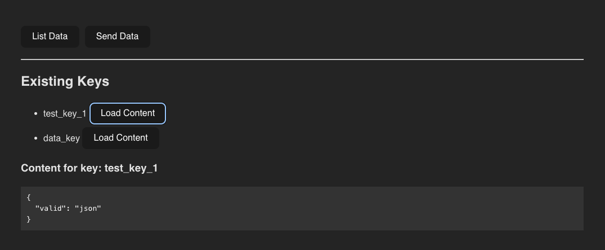
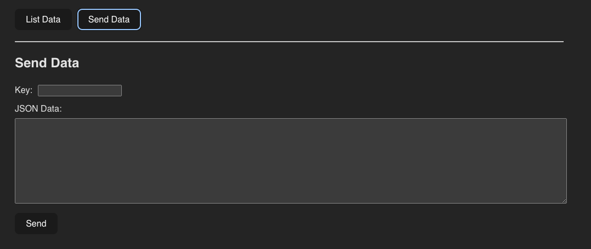

## Golang backend + React frontend

A small warmup code, showcasing a data storage mechanism.

User can store and retrieve their jsons data via user interface, connecting to go app that holds the data in memory.

### Usage

1. Trigger backend:
```bash
go run main.go
```

2. Create a template React App:
```bash
npm create vite@latest
```

3. Alter App.tsx

4. Trigger frontend
```bash
npm i & npm run dev
```

### Screens



